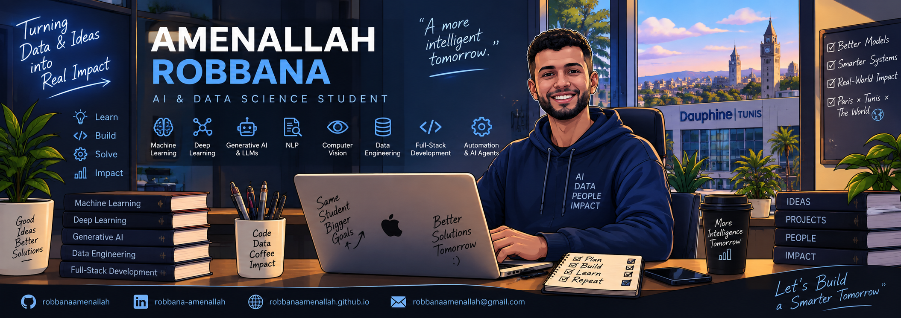

<p align="center">
  
</p>
<div align="center">

# Hi, I'm Amenallah Robbana 👋

### AI & Data Science Master's Student | Machine Learning • Deep Learning • Generative AI

<p>
Building intelligent, data-driven solutions at the intersection of
<strong>Artificial Intelligence, Data Science and Software Engineering</strong>.
</p>

<p>
  <a href="https://www.linkedin.com/in/robbana-amenallah/">
    
  </a>
  <a href="mailto:robbanaamenallah@gmail.com">
    
  </a>
  <a href="https://robbanaamenallah.github.io/">
    
  </a>
</p>

</div>

---

## 👨‍💻 About Me

I am a Master's student in **Artificial Intelligence, Data Science & Agentic AI** at **Université Paris Dauphine – Tunis Campus**, passionate about designing intelligent systems that transform data into practical, impactful solutions.

My work spans the complete AI development lifecycle — from **data preprocessing, exploratory analysis and feature engineering** to **machine learning, deep learning, generative AI, model evaluation, application development and workflow automation**.

I enjoy working at the intersection of **AI, Data and Software Engineering**, combining predictive models with modern web technologies to build complete end-to-end intelligent applications.

- 🎓 Master's in **Artificial Intelligence, Data Science & Agentic AI**
- 🤖 Focused on **Machine Learning, Deep Learning & Generative AI**
- 🧠 Exploring **RAG, Agentic AI, NLP and intelligent automation**
- 👁️ Building projects in **Computer Vision, predictive analytics and Data Mining**
- ⚙️ Developing **end-to-end AI-powered applications**
- 🌐 Experienced with **Full-Stack development and REST APIs**
- 🔬 Interested in solving real-world problems through **data-driven systems**

---

## 🎯 Areas of Interest

```text
Artificial Intelligence     ████████████████████
Machine Learning            ████████████████████
Generative AI               ███████████████████░
Deep Learning               ███████████████████░
Data Science                ████████████████████
RAG & Agentic AI            ██████████████████░░
NLP                         ██████████████████░░
Computer Vision             ██████████████████░░
AI Automation               ██████████████████░░
Full-Stack AI Apps          █████████████████░░░
```

---

# 🛠️ Technical Stack

## 🤖 AI & Machine Learning

<p>


</p>

<p>

</p>

**Libraries & Frameworks**

`Scikit-learn` • `TensorFlow / Keras` • `XGBoost` • `Pandas` • `NumPy` • `OpenCV` • `Matplotlib` • `Seaborn`

---

## 💻 Programming Languages

<p>

</p>

---

## 🌐 Web Development & AI Applications

<p>

</p>

`React` • `Angular` • `Node.js` • `Express.js` • `FastAPI` • `Streamlit` • `REST APIs`

---

## 🗄️ Data & Databases

<p>

</p>

`PostgreSQL` • `SQL Server` • `MySQL` • `MongoDB` • `Supabase` • `Power BI` • `Talend`

---

## ⚙️ Tools & Automation

<p>

</p>

`Git` • `GitHub` • `Docker` • `Jupyter Notebook` • `VS Code` • `n8n`

---

# 🚀 Featured Projects

## 🛡️ ChurnGuard — Intelligent Customer Churn Prediction

> **AI • Data Science • RAG • Automation**

End-to-end intelligent solution designed to predict customer churn and support customer-retention strategies.

**Highlights**

- Complete data pipeline from **SQL Server to PostgreSQL**
- Data cleaning, structuring, EDA and feature preparation
- Predictive modeling using **ZINB, LSTM and XGBoost**
- Interactive analytical dashboards
- Integration of **RAG-based intelligent agents**
- Workflow automation using **n8n**

**Tech:** `Python` • `XGBoost` • `LSTM` • `ZINB` • `PostgreSQL` • `RAG` • `n8n`

---

## 🏦 PRIMIA — Intelligent B2B Credit Insurance Platform

> **Hackathon AI / InsurTech — Université Paris Dauphine Tunis × EY**

AI-powered B2B SaaS platform designed to automate credit-insurance premium calculation and financial risk assessment.

**Highlights**

- Automated financial PDF extraction using **Gemini LLM**
- Dynamic risk scoring based on **7 weighted indicators**
- Predictive models using **Random Forest & XGBoost**
- Custom premium optimization based on risk, commissions and remaining capital
- Full-Stack SaaS architecture with **React + Node.js/Express**
- Secure data and user management using **Supabase/PostgreSQL**

**Tech:** `Gemini LLM` • `XGBoost` • `Random Forest` • `React` • `Node.js` • `Supabase`

---

## 👁️ Real-Time Distraction Detection

> **Computer Vision • Deep Learning**

Real-time intelligent system for detecting distraction through **eye-gaze analysis and smartphone detection**.

**Highlights**

- Facial landmark and gaze tracking using **MediaPipe Face Mesh**
- Smartphone detection using **YOLO**
- Temporal concentration/distraction state management
- Session-level behavioral statistics

**Tech:** `Python` • `OpenCV` • `MediaPipe` • `YOLO` • `Pandas`

---

## 🏀 NBA Data Analytics & Prediction

> **Web Scraping • Machine Learning • Data Visualization**

Data-driven application for collecting, processing and analyzing NBA data from **2010–2025**.

**Highlights**

- Automated NBA data collection through web scraping
- Data preprocessing and feature engineering
- Predictive Machine Learning models
- Interactive analytics application built with **Streamlit**

**Tech:** `Python` • `Pandas` • `BeautifulSoup` • `Machine Learning` • `Streamlit`

---

## 🖼️ Seam Carving — Content-Aware Image Resizing

> **Algorithms • Graph Theory • Computer Vision**

Implementation of the **Seam Carving** algorithm for intelligent content-aware image resizing using graph theory and shortest-path optimization.

**Highlights**

- Dual-gradient energy map computation
- Image modeled as a **Directed Acyclic Graph (DAG)**
- Optimal seam extraction using **topological ordering + shortest path**
- Optimal complexity of **O(H × W)**
- Performance comparison with **Dijkstra**
- Approximately **15 ms/seam vs 85 ms/seam** in the project benchmark

**Tech:** `Python` • `NumPy` • `OpenCV` • `Graph Theory` • `DAG` • `Dijkstra`

---

## 🧠 Administrative Complaints & Digitalization

> **Machine Learning • Deep Learning • NLP**

AI pipeline for predictive analysis of administrative complaints combining structured data, textual information and geographical analysis.

**Highlights**

- Tabular Machine Learning and PCA
- MLP-based modeling
- NLP with **TF-IDF and BERT/CamemBERT**
- Geographic analysis of predictions and errors by governorate
- UTM 32N-based mapping and spatial analysis

**Tech:** `Python` • `Scikit-learn` • `XGBoost` • `MLP` • `TF-IDF` • `CamemBERT` • `NLP`

---

## 📊 Data Mining — Predictive Analytics

> **Real Estate • Hospitality • Machine Learning**

Two applied Data Mining use cases covering rental-price prediction and hotel-reservation revenue analytics.

**Housing Rental Prices**

- EDA, preprocessing and feature engineering
- Regression-model development and optimization
- Rental-price prediction

**Hotel Reservations**

- SMOTE-based data balancing
- Classification with **AUC-ROC 0.915**
- Regression with **CV R² 0.70**
- KMeans clustering
- Model interpretability using **SHAP / LIME**

**Tech:** `Python` • `Pandas` • `Scikit-learn` • `SMOTE` • `KMeans` • `SHAP` • `LIME`

---

# 💼 Experience

### 🚀 EpicDev

**Full-Stack, AI & Automation Developer Intern — 2026**

Developed a logistics and delivery SaaS platform combining **React, TypeScript, Node.js, PostgreSQL and Supabase**, with JWT/RLS/RBAC security, an AI chatbot and automated mailing workflows using n8n.

### 📡 3S / GlobalNet

**AI, Data & Web Developer Intern — ChurnGuard — 2025**

Designed an end-to-end customer churn prediction and retention solution combining data engineering, predictive modeling, interactive dashboards, RAG and intelligent workflow automation.

### 🌐 FormaLab

**Full-Stack Developer Intern — 2024**

Developed Full-Stack web applications and RESTful APIs using **Node.js, Express.js and JavaScript**.

---

# 🎓 Education

### Université Paris Dauphine — Tunis Campus

**Master's in Artificial Intelligence, Data Science & Agentic AI**  
`2025 — 2027`

Machine Learning • Deep Learning • NLP • Generative AI • Reinforcement Learning • Time Series • Data Mining • Big Data

### ESSECT

**Bachelor's Degree in Business Computing**  
`2023 — 2025`

---

# 📊 GitHub Analytics

<div align="center">


</div>

<div align="center">


</div>

---

# 🌱 Currently Exploring

```python
current_focus = {
    "AI": [
        "Generative AI",
        "Agentic AI",
        "Retrieval-Augmented Generation",
        "Intelligent Agents"
    ],
    "Machine Learning": [
        "Deep Learning",
        "NLP",
        "Computer Vision",
        "Time Series"
    ],
    "Engineering": [
        "End-to-End AI Applications",
        "AI Automation",
        "Full-Stack AI Systems"
    ]
}
```

---

# 🤝 Leadership & Community

Beyond technology, I am actively involved in student and community organizations, developing experience in **leadership, team coordination, training and organizational management**.

- **Legal Advisor** — JCI Nouvelle Médina, 2026 — Present
- **VP Training & Development** — JCI Nouvelle Médina, 2025
- **Human Resources Manager** — InfoLab ESSECT, 2024 — 2025
- **Treasurer** — JCI Nouvelle Médina, 2024
- **President** — JCI Nouvelle Médina Junior, 2019  
  🏆 **Elected Best Junior President in Tunisia**

---

# 🌍 Languages

🇹🇳 **Arabic** — Native  
🇫🇷 **French** — Advanced  
🇬🇧 **English** — Intermediate

---

# 📫 Let's Connect

<div align="center">

I'm interested in **Artificial Intelligence, Data Science, Generative AI, Machine Learning and intelligent software projects**.

Open to **collaborations, AI/Data projects, internships and professional opportunities**.

<br>

<a href="mailto:robbanaamenallah@gmail.com">
  
</a>

<a href="https://www.linkedin.com/in/robbana-amenallah/">
  
</a>

<a href="https://robbanaamenallah.github.io/">
  
</a>

<br><br>

### 💡 _Building intelligent systems from data to deployment._

</div>
